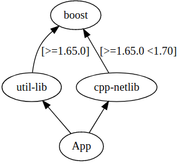
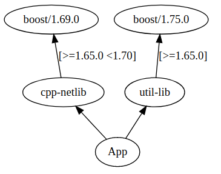

# Context

This test case comes from [eclipse/cloe #11](https://github.com/eclipse/cloe/issues/11).

Conan version: 1.33.0

# Steps to reproduce the problem

`python3 build.py`

# Expected behavior



# Observed behavior



```
ERROR: Conflict in TMP-util-lib/1.0.0@user/testing:
    'TMP-util-lib/1.0.0@user/testing' requires 'TMP-boost/1.75.0@user/testing' while 'TMP-cpp-netlib/1.0.0@user/testing' requires 'TMP-boost/1.69.0@user/testing'.
    To fix this conflict you need to override the package 'TMP-boost' in your root package.
```